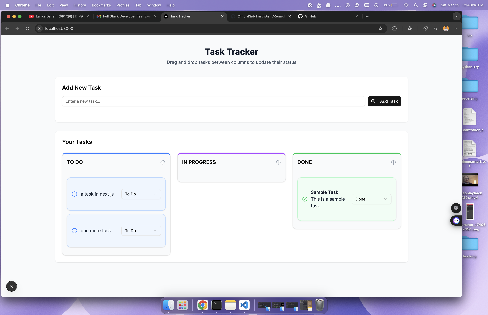
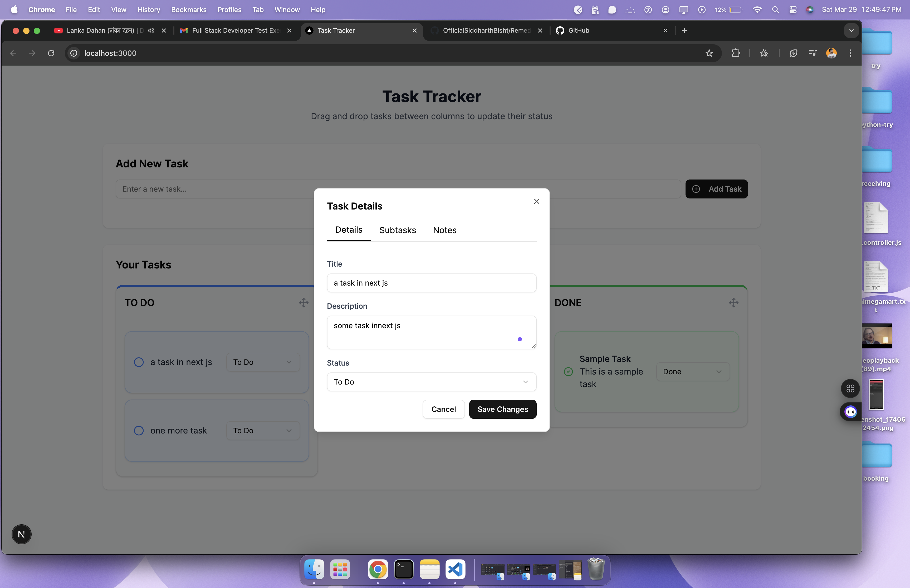
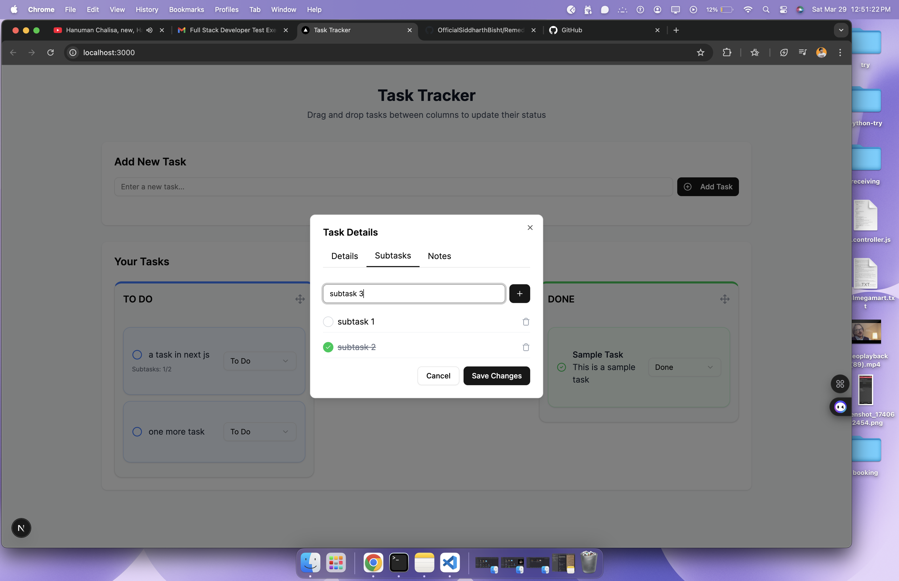

# Taskington - Task Management Application

A modern task management application built with Next.js, featuring a clean UI and real-time task status updates.

## Features

- Create and manage tasks with descriptions
- Update task status (To Do, In Progress, Done)
- Real-time UI updates
- Subtask support (one level)
- Visual status indicators
- RESTful API endpoints
- JSON file-based data storage

## Tech Stack

- **Frontend:**
  - Next.js 15
  - React 19
  - Tailwind CSS
  - Radix UI Components
  - React Query for data fetching
  - TypeScript

- **Backend:**
  - Next.js API Routes
  - JSON Server for data persistence
  - RESTful API endpoints

## Getting Started

### Prerequisites

- Node.js (v18 or higher - version 22 LTS preferred)
- npm or yarn

### Installation

1. Clone the repository:
```bash
git clone <repository-url>
cd taskington-next
```

2. Install dependencies:
```bash
npm install
# or
yarn install
```

3. Start the development server:
```bash
# Start the Next.js development server
npm run dev
# or
yarn dev

# In a separate terminal, start the JSON server
npm run server
# or
yarn server
```

The application will be available at [http://localhost:3000](http://localhost:3000), and the JSON server will run on [http://localhost:3001](http://localhost:3001).

## Project Structure

```
taskington-next/
├── app/                    # Next.js app directory
│   ├── api/               # API routes
│   └── page.tsx           # Main page component
├── components/            # React components
├── db.json               # JSON Server database
└── public/               # Static assets
```

## API Endpoints

- `GET /api/tasks` - Fetch all tasks
- `POST /api/tasks` - Create a new task
- `PATCH /api/tasks/:id` - Update task status

## Task Statuses

- To Do
- In Progress
- Done

## Development

- The frontend is built with Next.js and uses Tailwind CSS for styling
- Radix UI components provide accessible UI elements
- React Query handles data fetching and caching
- JSON Server provides a RESTful API for data persistence

## Sceenshots





## Video 
[Video Link](https://youtu.be/A1t4IotjmiA)  

# Remedo-Clinitech-Assignment
